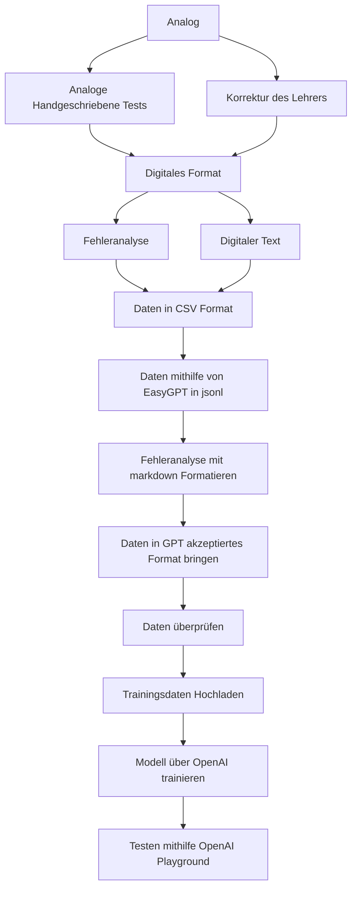

<p align="right">
  
</p>

# Test-GPT 

> [!WARNING]
> OpenAI hat GPT 4 fuer fine tuning Modelle freigestellt. Somit werden kommende Modelle einen Boost der Performance bekommen, jedoch etwas langsamer sein!

Integration von Language Model (LLM) im Bildungsbereich zur Automatisierung von Schülertestkontrollen: Wir setzten auf die ChatGPT-API, die es uns durch fine-tuning ermöglicht, Schülertests automatisch zu bewerten und detaillierte Rückmeldungen zu generieren.


### Update 1.0 (gpt 3.5 turbo)
> [!NOTE]
> basierend auf 12 Tests

> basierend auf 0 Aufgaben

### Update 1.1 (gpt 3.5 turbo)
> [!NOTE]
> basierend auf 18 Tests

> basierend auf 0 Aufgaben
- verbesserte/vereinfachte Fehleranalyse -> besseres learning
- Fehlerbehebung in Trainingsdaten

## Update 1.2 (gpt 3.5 turbo)
> [!NOTE]
> basierend auf 20 Tests

> basierend auf 0 Aufgaben


> [!IMPORTANT]
> Verbesserungen:
- verbesserte Einbindung von Zitaten, welche nun makiert werden (Website GUI)
- Erste Formatierung basierend auf Markdown
- Formatierte Tests als Trainingsdaten fuer mehr variabelitaet
- Einbindung von CSV formatierten tabellen als Trainingsdaten.
> [!NOTE]
> Trainingsdaten wurden eingebunden formatierung funktioniert!.


Beispiel:


- Testanalyse mithilfe eines weiterfuehrenden Chatbots, zur befragen von z.b. Fehlern: getestet, funktioniert!


> [!IMPORTANT]
> [Das Dokument, mit Modell Tests kann man sich hier anschauen, es zeigt Probleme, verbesserungen (auch in der Zukunft) und Beispiele jeder Modelle:](https://github.com/cheatoskar/Test-GPT/blob/main/Readme/ModellTest.md)

## Update 1.3 (gpt 3.5 turbo)
> [!NOTE]
> basierend auf ins. 30 Tests, Klausuren, Kurztests und Einzelaufgaben

GERADE IN BEARBEITUNG!


# Trainingsdaten an OpenAI senden und Modelltraining starten

Dieses Repository enthält den Code und die Anleitungen zum Senden von Trainingsdaten an OpenAI und zum Starten des Modelltrainings. Weitere Informationen zum Fine-Tuning findet man [hier](https://platform.openai.com/docs/guides/fine-tuning).

## Inhaltsverzeichnis
- [Voraussetzungen](#voraussetzungen)
- [Schritt 1: Daten vorbereiten](#schritt-1-daten-vorbereiten)
- [Schritt 3: Daten verarbeiten/überprüfen](#schritt-3-daten-überprüfen)
- [Schritt 4: Modelltraining starten](#schritt-4-modelltraining-starten)

## Voraussetzungen
Bevor Sie beginnen, stellen Sie sicher, dass Sie die folgenden Voraussetzungen erfüllen:
- Python ist installiert.
- Sie verfügen über ein API-Token von OpenAI.
- Die OpenAI Python-Bibliothek ist installiert (verwenden Sie `pip install openai`).

>[!NOTE]
> **Hinweis:** Das Erstellen eines API-Tokens finden Sie [hier](https://platform.openai.com/account/api-keys). Die Verwendung der OpenAI-API ist kostenpflichtig .

## Schritt 1: Daten vorbereiten
Für unser Projekt müssen wir die Trainingsdaten von einem analogen Format in ein digitales Format umwandeln. Dies kann entweder manuell erfolgen oder mithilfe fortschrittlicher OCR-Software, die handgeschriebenen Text einscannt.



Da unser Modell Tests bewerten soll, brauchen wir immer 3 verschiedene Inputs, die das Modell benoetigt:|

1. **Aufabenstellung inkl. Quellen, Tabellen usw.**

2. **Antworten des Schuelers**

3. **Fehleranalyse (Bewertung des Lehrers)**

4. **Ehr Optional Punkte pro Aufgabe**


### Fehleranalyse
Die **Fehleranalyse** ist der Teil, denn wir unserem Modell spaeter als Output vorgeben werden, also dass, was es antworten soll.
>[!IMPORTANT]
>Die Fehleranalyse ist ein Teil der Trainingsdaten, ist **menschlich verfasst**, und basiert auf den Bewertungen der Lehrer in Tests
>Sie wurden Digitalisiert und dem Modell **angepasst**, um es auf Zitierung usw. zu trainieren!

Die Idee ist hierbei, diese so uebersichtlich wie moeglich zu gestalten. Eine Fehleranalyse besteht aus folgenden Parts hier ist ein Beispiel:

```python
Fehleranalyse: 

Aufgabe 1 (6 von 6 Punkte) //Aufgabe mit voller Punktzahl
Aufgabe 2 (6 von 8 Punkte):

- "als auch die soziale Disziplinierung" bezieht sich auf " z.B. Durch Bildung usw." Ist falsch! (-1 Punkt) 

- "ein komplexer und langjähriger Prozess war" Warum? Kriege... ungenau (-1 Punkt) 

Aufgabe 3 (7 von 7 Punkte) 

Insgesamt: 
	Punkte: 18 von 21, das entspricht einer Leistung von: 85% 
	Vorgeschlagene Note: 1-
```

In der Fehleranalyse, welche immer gleich Aufgebaut ist, stellen wir nun alle Fehler im Test geordnet dar.
Als erstes haben wir unsere Ueberschrift:
```Fehleranalyse:```
Dann Listen wir Aufgabe fuer Aufgabe auf:
```python
Aufgabe 1 (6 von 6 Punkte) //Aufgabe mit voller Punktzahl
Aufgabe 2 (6 von 8 Punkte): // Aufgabe mit Fehlern
```
In unsere Aufgabe mit Fehlern Listen wir nun alle Fehler der jeweiligen Aufgabe auf. In Aufgabe 2, haben wir
z.B. folgende Fehler:
```python
Aufgabe 2 (6 von 8 Punkte):

- "als auch die soziale Disziplinierung" bezieht sich auf " z.B. Durch Bildung usw." Ist falsch! (-1 Punkt) 

- "ein komplexer und langjähriger Prozess war" Warum? Kriege... ungenau (-1 Punkt) 
```
1. Wir achten hierbei darauf, dass wir Zitieren, um das Modell darauf zu trainieren, die Fehler zu makieren.
2. Optional, geben wir auch eine Frage oder Eine Erklaerung mit, um das Modell auch darauf zu Trainieren.
3. Schlussendlich, geben wir einen Punktabzug an, um dem Modell zu zeigen, wie viel Punktabzug, welcher Fehler 'Wert' ist.
4. Ausserdem halten wir eine stetige Formatierung bei z.B. in der Rheinfolge wie der Schueler die Fragen beantwortet hatte, listen wir unsere Fehlernanlyse auf, oder das einruecken von Unteraufgaben usw.

Zum Schluss, soll das Modell eine Schnelluebesicht ausgeben hier ```Insgesamt```.
Hier sollen die Punkte, Leistung in ```%``` und die Vorgeschlagene ```Note``` angegeben werden.

>[!NOTE]
>Das Modell wird groesstenteils auf Tests der Oberstufe trainiert, um eine genauere bewertung zu ermoeglichen. 
>Daher sind die Leistung, als auch die Note dem Oberstufensystem angepasst. Hierbei rechnen wir die ```Punkte``` in Leistung ```%``` um
>Die sich daraus ergebenden Oberstufen Notenpunkte, werden in Normalen Noten angegeben.

Haben wir unsere Trainingsdaten umgewandelt (Word-Dokument), koennen wir zu Schritt 2 uebergehen:

## Schritt 2: Daten vorbereiten
### Das Daten Vorbereiten, ist nach dem Digitalisieren das aufwendigste und passiert in mehreren Schritten


1. CSV-Format: Die Daten aus den Word-Dokumenten können in ein CSV-Tabellendokument exportiert werden, um eine tabellarische Darstellung zu erhalten. Hierbei werden zwei Spalten erstellt: eine für die Eingabe (Prompt) und eine für die erwartete Ausgabe (Antwort).


2. Wir wandeln die Fehleranalyse in eine Markdown formatierte Datei um, welche dauerhaft die selbe art der Foramtierung aufweist, um diese dem Modell zu erlernen. Solch eine Date kann z.b. so aussehen:
   ```
	"Fehleranalyse:\n\tDIE REFORMATION MARTIN LUTHER - EINE QUELLE ANALYSIEREN:\n\n\tA (5 von 8 Punkte):\n\t\t- Auf vollständige Sätze achten! (-1 Punkt)\n\t\t- \"Textart: Quasi (Statement)\" ist falsch. Die Textart = Brief (-1 Punkt)\n\t\t- \"Adressanten: An alle 	gläubigen und Beiger\" ist falsch! Der Brief richtet sich an \"Erzbischof Albrecht von Mainz\" (-1 Punkt)\n\n\tB (5 von 5 Punkte)\n\tC (5 von 5 Punkte)\n\n\tAufgabe 2 (5 von 6 Punkte):\n\t\t- Bezug zur Reformation ist unvollständig (-1Punkt)\n\n\tInsgesamt:\n\t\tPunkte: 20 von 24, das entspricht einer Leistung von: 83%\n\t\tVorgeschlagene Note: 2+ ENDSTOP"
   ```
   (Jsonl format)

   >Der Schluss mit dem wir das Modell Trainieren ist `ENDSTOP`
   >Das Modell lernt mit der Zeit die Fehleranalyse mit ```\t\n``` auszugeben.
   >Hierbei enstpricht ```\n``` einem Zeilenumbruch und ```\t``` einem Tab. So sieht diese Datei Spaeter auf z.b. einer Website so aus:


   

4. Die CSV Datei, senden wir nun an [EasyGPT](https://easygpt.io/), eine Website, die unteranderem die Daten als JSONL Datei wieder ausgeben kann. JSONL ist das dateinformat, welches OpenAI verlangt.
   Haben wir die Daten als JSONL, muessen wir sie aber nun noch in ein gueltiges Format fuer die Chat-Modell umwandeln.
   Das Modell, welches wir benutzen ist: ```gpt-3.5-turbo-0613```. Dieses Chat-Modell akzeptiert folgendes Format:
   ```jsonl
   {"messages": [{"role": "system", "content": "Die Rolle des Modells z.b. Geschichtslehrer"},{"role": "user", "content": "Eingabe des Benutzers z.b. Test"},{"role": "assistant", "content":"Erwartete Antwort des Modells auf die Gegebene Eingabe des Nutzers"}]}
   "..."
   "..."
   ```
   Wir erhalten aber nun folgendes Format von EasyGPT:
   ```jsonl
   {"prompt": "eINGABE", "completion": "AUSGABE MODELL"}
   ```
   Nach der Manuellen Umwandlung in das erste Format, welches wir benoetigen ```{"messages": [{"role": "system", "content":""...```, haben wir eine Trainingsdatei.
   Solch eine Date kann z.b. so aussehen [Trainingdata](./trainingsdatagpt3.5.jsonl)
   
6. Unsere Trainingsdatei, welche nun immer ein Test und eine Fehleranalyse im gewuenschten Output stehen hat, laden wir nun auf die OpenAI Server hoch.
   ```python
	import openai
	import os
	openai.api_key = "API-KEY"
	
	response = openai.File.create(
	  file=open("trainingsdata.jsonl", "rb"), //Auswahl der Trainingsdaten-Datei
	  purpose='fine-tune' // Auftrag: Fine Tuning
	)
	
	print(response) //Ausgabe der File-ID, welche wir von OpenAI bekommen

	#Teile hiervon sind von diesem Tutorial: https://www.youtube.com/watch?v=_yzmQbez7gk&t
   ``` 

## Schritt 3: Daten überprüfen
Vor dem Senden der Daten an OpenAI ist es wichtig sicherzustellen, dass sie den Qualitätsanforderungen entsprechen. Dazu koennen wir Optional nochmals pruefen, ob unsere Trainingsdaten korrekt hochgeladen wurden
```python
import os
import openai
openai.api_key = "API-KEY"
content = openai.File.download("file-ID") //Download des trainingfiles mit der vorher erhaltenen ID
print(content) //Ausgabe der Datei
```
Und zusaetzlich Checken wir, wie viele tokens, also Woerter unsere Daten enthalten 1 Token sind hierbei ca. 3-4 Zeichen
```python
import openai
openai.api_key = 'API-KEY'

# Tokens Zaehlen
token_count = openai.Completion.create(
    engine="text-davinci-003",  # Modell
    prompt= "Test, den wir Pruefen wollen, oder Var. fuer unseren Trainingsfile",
    max_tokens=0
)['usage']['total_tokens']

print(f"Token count: {token_count}") //Ausgabe der Tokens
```
Hiermit Pruefe ich teils lange Tests, um zu schauen, ob diese nicht ueber das Eingbaelimit von 4096 tokens gehen.
Auch Optional koennen wir den Status unserer Datei abrufen mit:
```python
import openai

# API Key (privat)
openai.api_key = "API-KEY"

# File ID, aendert sich, je nach Modell
file_id = "file-ID"

file_info = openai.File.retrieve(id=file_id) //File ID suchen
print("File Status:", file_info.status)
print("Status Details:", file_info.status_details) //Status ausgeben
```


## Schritt 4: Modelltraining starten
Sind unsere Trainingsdaten hochgeladen, koennen wir nun das Training starten lassen hierzu:
```python
import os
import openai
openai.api_key = "API-KEY"
file_id = "file-ID" //File ID auswahlen
response = openai.FineTuningJob.create(training_file=file_id, model="gpt-3.5-turbo-0613") //Modell waehlen
print(response)
```
Dieser Code passt keine Variablen des Modells an, sondern laesst es automatisch selber entscheiden.
Hier legt es z.b die ```Epochs```, also die Trainingszyklen und weitere Parameter fest.
[Weitere Informationen zu Parametern (nutzung)](https://github.com/cheatoskar/Test-GPT#openai-playground-gpt-3-parameter)


Danach erhaelt man eine Email, dass sein Modell fertig ist, dieser Prozess dauert meist 5-20min.

Unser Modell koennen wir nun testen auf [OpenAI Playground](https://platform.openai.com/playground).
Oder wir machen anfragen direkt ueber python.

Im OpenAI Playground koennen wir einfach Sachen anpassen, prompts,Rollen eingeben und experimentieren. Aussderem, koennen wir Chats Speichern, und diese folglich spaeter anschauen zur Analyse:
Hier sind einige Chats:
[v1.1/1.2 Chat 1](https://platform.openai.com/playground/p/tYEIgF7qAND2GTmJZL9Lpeib?model=ft:gpt-3.5-turbo-0613:personal::8F1RLvEo)

[v1.2 Chat 2](https://platform.openai.com/playground/p/AUmLC8W1ZxHYm2oUCFjFVhIp?model=ft:gpt-3.5-turbo-0613:personal::8F1RLvEo)

[v1.2 Chat 3](https://platform.openai.com/playground/p/0oV0PGXwWyzO2wTIA408mzSH?model=ft:gpt-3.5-turbo-0613:personal::8F1RLvEo)

Aeltere Modelle:
[v 1.0 Chat 4](https://platform.openai.com/playground/p/E4J2AOMLS6MdwroNqsV224Ok?model=ft:gpt-3.5-turbo-0613:personal::849ySJer)

>[!WARNING]
Dieser Artikel ist gerade in Arbeit und unvollständig.

# Modellparameter und ihre Auswirkungen

## Die Modellparameter

Die Modellparameter spielen eine entscheidende Rolle, um die gewünschten Antworten von unserem Modell zu erhalten. Hier sind einige der wichtigsten Parameter, die wir berücksichtigen:

### Prompt: 
Der Ausgangspunkt jeder Modellanfrage. Das Prompt enthält die Informationen, die Sie dem Modell geben, um eine Antwort zu generieren. 

### Rollenbestimmung: 
Die Rolle definiert, welche Aufgabe oder Funktion ein Textausschnitt im Gespräch hat bzw. wie das Modell mit ihnen umgehen soll. 

### Maximale Token: 
Dieser Parameter begrenzt die Anzahl der Tokens in der Modellantwort. Es beeinflusst die Länge und Detailgenauigkeit der generierten Antworten.

### Stop-Sequenzen: 
Symbole oder Zeichen, die das Modell dazu veranlassen, die Antwort zu beenden. 

### Temperatur: 
Steuert die Zufälligkeit der Antworten.

### Top-P: 
Dieser Parameter beeinflusst die Wahrscheinlichkeit, mit der das Modell die am häufigsten vorkommenden Tokens in der Antwort auswählt.

### Frequency_penalty:
Dient dazu, das Modell davon abzuhalten, zu häufig dieselben Wörter oder Phrasen im generierten Text zu wiederholen.

>[!IMPORTANT]
>Die für uns wichtigen Parameter sind: ```Rolle```, ```max. Tokens```, ```Temperatur```, ```Stop Sequenz```, ```Frequency_penalty:```

## Auswirkungen der Parameter

>[!NOTE]
> Um die Auswirkung zu überprüfen, verwenden wir denselben Test (Prompt) im OpenAI Playground und schauen, inwieweit sich die Ausgabe des Modells ändert. Dadurch finden wir heraus, welche Parameter-Einstellungen die besten Ergebnisse an unserem Modell zeigen.

### Temperatur

Die Temperatur ist ein kritischer Parameter, der die Zufälligkeit der Modellantworten steuert. Eine höhere Temperatur (z. B. 1) führt zu mehr Zufälligkeit und kreativen Antworten, während niedrigere Temperaturen (z. B. 0.3) zu präziseren und weniger zufälligen Antworten führen.

| Temperatur | Auswirkung (Beschreibung) | Bewertung |
| --- | --- | --- |
| 1 | Normale Zufälligkeit, kreative Antworten | Befriedigend  |
| 0.5 | Verringerte Zufälligkeit, kreative Antworten sind weniger zu erkennen | Gut |
| 0.3 | Sehr niedrige Zufälligkeit, gute Mischung aus präzisen und kreativen Antworten | Sehr Gut |
| 0 | Geringe Zufälligkeit, präzise Antworten | Sehr gut |

### Maximale Tokens

Die maximale Anzahl von Tokens beeinflusst direkt die Länge der Modellantworten. Eine zu niedrige Einstellung (z. B. 256) kann zu unvollständigen Antworten führen, während eine zu hohe Einstellung (z. B. 1024) möglicherweise zu redundanten Informationen führt.

| Tokens | Auswirkung (Beschreibung) | Bewertung |
| --- | --- | --- |
| 256 | Die Antwort wird abgeschnitten und ist unvollständig. | Schlecht |
| 512 | Angemessene Länge der Antwort, aber möglicherweise nicht detailliert genug. | Gut |
| 750 | Gute Länge der Antwort mit ausreichenden Details. | Sehr Gut |
| 1024 | Optimale Länge für umfassende und präzise Antworten. | Optimal |

>[!IMPORTANT]
>Durch das Training auf unseren eigenen Daten unter Verwendung von Stop-Sequenzen hat unser Modell die Fähigkeit erworben, unabhängig von der Tokenlänge zu agieren. Es bestimmt den Abschluss basierend auf der Testlänge und der Anzahl der Fehler selbstständig. Im Vergleich zu früheren Modellen, die dazu neigten, bis zum Erreichen des Tokenlimits zu schreiben, kann unser aktuelles Modell flexibler und effizienter auf unterschiedliche Testbedingungen reagieren.

# Die Rolle des Modells: Einfluss auf die Antworten

Die Rolle, die einem Modell zugewiesen wird, spielt eine entscheidende Rolle bei der Generierung von Antworten. Sie definiert nicht nur den Kontext, sondern beeinflusst auch den Stil, die Tonlage und die inhaltliche Ausrichtung der generierten Informationen. In diesem Artikel werden wir den Einfluss der Modellrolle auf die Antworten unseres Language Models (LLM) genauer betrachten.

### Die Bedeutung der Modellrolle

Die Modellrolle ist die zugewiesene Aufgabe oder Funktion, die das Modell im Rahmen des Gesprächs oder der Anfrage übernehmen soll. In unserem Fall lautet die ursprüngliche Rolle: "Du bist ein Geschichtslehrer, welcher Tests von Schülern kontrolliert, Fehler findet, und diese systematisch, formatiert darstellt."

### Einfluss auf den Antwortstil

Die Modellrolle beeinflusst maßgeblich den Stil der generierten Antworten. Bei einem Geschichtslehrer könnte das Modell dazu neigen, formelle und sachliche Informationen zu priorisieren. Im Gegensatz dazu könnte die Rolle eines kreativen Schriftstellers zu eher elaborierten und künstlerischen Antworten führen.

### Kontextverständnis und Relevanz

Die klare Definition der Modellrolle trägt dazu bei, dass das Modell den Kontext besser versteht und relevantere Informationen produziert. Ein Geschichtslehrer würde sich beispielsweise auf historische Fakten und Fehler in Tests konzentrieren, während ein Mathematiklehrer sich auf mathematische Konzepte fokussieren würde.


## Fazit

Die Auswahl der Modellparameter ist entscheidend, um die gewünschten Antworten von unserem Modell zu erhalten. Je nach Anwendungsfall und Zielsetzung können Sie die Parameter anpassen, um die Qualität und den Stil der Antworten zu steuern. Ein Verständnis dieser Parameter ermöglicht es Ihnen, das Modell effektiver zu nutzen und optimal auf Ihre Anforderungen abzustimmen. Im Laufe der Anpassung und Experimentation können Sie die Feinabstimmung vornehmen, um die bestmöglichen Ergebnisse für Ihre spezifische Nutzungssituation zu erzielen.

# Modells 


>[!NOTE]
> Um die Modelle miteinander zu vergleichen, werden sie auf dem selben Test getestet, und auch einem zu vor nie gesehenem kurz Test

[Der Test zum Vergleich, Kurztest](https://github.com/cheatoskar/Test-GPT/blob/main/Readme/Test.md)

Die Optimale Antwort waere hierbei diese hier:
```python
Fehleranalyse: 
  Aufgabe 1 (6 von 6 Punkte) 
  Aufgabe 2 (6 von 8 Punkte): 
    - "als auch die soziale Disziplinierung" bezieht sich auf " z.B. Durch Bildung usw." Ist falsch! (-1 Punkt) 
    - "ein komplexer und langjähriger Prozess war" Warum? Kriege... ungenau (-1 Punkt) 
  Aufgabe 3 (7 von 7 Punkte)
Insgesamt:
  Punkte: 18 von 21, das entspricht einer Leistung von: 85% 
  Vorgeschlagene Note: 1- 
```

und fuer den Kurztest:
```python
Fehleranallyse: 

	Frage 1 (1 von 1 Punkt) 

	Frage 2 (0 von 1 Punkte): 

		- Die berühmte Rede hieß "I have a Dream". (-0,5 Punkte) 

	Frage 3 (0 von 1 Punkte): 

		- Der Name des Entdeckers war Christopher Kolumbus nicht Kolimbo. (-0,5 Punkte) 

	Frage 4 (1 von 1 Punkt) 

	Frage 5 (0,5 von 1 Punkte): 

		- Antwort auf: Welches Amt hatte er vor seiner Präsidentschaft inne? Fehlt! (-0,5 Punkte) 

	Frage 6 (0,5 von 1 Punkte): 

		- Antwort auf: Welches spezifische Ereignis markiert das Ende des Krieges? Fehlt! (- 0,5 Punkte) 

 

Insgesamt: 

... 
```
So oder aehnlichm sollte es aussehen, hier habe ich nur dir fehler angegeben, die das Modell im besten fall alle findet.
## Modell v 1.0

#### Gesehener Test Antwort:
```python
#Fehleranalyse:

###Aufgabe 1 (5 von 6 Punkten): 
**{Unvollständig/UV} :**- {Zäsuren: Reformation} Reibungspunkt/Theorie hinzufügen. [-0,5 Punkte] **{Beispiel/Ex}
 :**- {Zäsuren: Anwendung Beispiel/AB} Reformation: Was war vorher? [{v:vor 1500}] [keine Punkte erhalten] **{Beispiel/Ex}
 :**- {Übergang: U} Reformation: Was kam danach? [keine Punkte erhalten]   ###Aufgabe 2 (7 von 8 Punkten):
 **{Kommasetzung/KS} :**- {Doppelpunkt: Klospapier} Doppelpunkt nach "Zudem war auch die soziale Disziplinierung,
 z. B. Durch Bildung usw." vergessen. [-0,5 Punkte]   ###Aufgabe 3 (7 von 7 Punkten): ##Insgesamt: Punkte: 19 von
21, Das entspricht einer Leistung von: 90%, Vorgeschlagene Note: 1-  ##Vorgeschlagene Maßnahmen:  ###Aufgabe 1:
{A1} -Bei Begriff Zäsur Reibungspunkte und bei Epochentyp Begründung für den Übergang fehlend. ##Vorgeschlagene
Noten: Aufgabe 1: 5 von 6 Punkten: Note: 83%, Punkte: 5 von 6 , Aufgabe 2: 7 von 8 Punkten: Note:88%, Punkte:
7 von 8, Aufgabe 3: 7 von 7 Punkten: Note: 100%, Punkte: 7 von 7, 
```


### KI-Fehleranalyse (Vergleich):

- Mangelnde Struktur und Aufteilung der Informationen in Abschnitte.
- Verwirrende Verwendung von Sonderzeichen, was die Lesbarkeit beeinträchtigt.
- Fehleridentifizierung ist teilweise ungenau und nicht präzise.
- Fehlerbegründungen sind allgemein und oft unklar in Bezug auf den Kontext.
- Notenvorschläge sind verwirrend und schwer verständlich.
- Antworten sehr lang, hoeren nicht auf, bis zum tokenlimit

#### Bewertung:

>[!WARNING]
>Auf einer Skala von 0 bis 10, wobei 10 das Optimalbild der menschlichen Analyse darstellt, würde ich der KI-Analyse eine Punktzahl von 2/10 geben, da sie Raum für erhebliche Verbesserungen bietet.

> [!NOTE]
> Verbesserungsvorschlaege:
> - Starke Simplifizierung der Fehleranalyse in den Trainingsdaten, Klare Strukturierung
> - Mehr Trainingsdaten, verbesserung von Fehlern in vorhandenen Daten
> - Stopsequenz hinzufügen!
> - Klarheit bei Notenvorschlägen
> - Datenvariation
> - Einbau von Zitierten Fehlern, fuer besseres verstaendnis

## Modell v 1.1

Aenderungen:
- Simplifizierung von Trainingsdaten  
	- Formatierung der Fehleranalyse Weglassen  
	- Sonderzeichen und Klammern weglassen 
	- Mehr Textbasiert arbeiten 
- Hinzufügen der Stopsequenz, damit keine ewig langen antworten generiert Werden 

#### Gesehener Test Antwort:
```python
Fehleranalyse:

Aufgabe 1 (6 von 6 Punkten):
- Keine Fehler.

Aufgabe 2 ( 7 von 8 Punkten):
- Aspekt "Konfessionalisierung" fehlt. (-1 Punkt)
- Unklare Aussage in der Schlussfolgerung. (kein Punkt erhalten)
   --> Aussage deutlicher machen. 
        z.B. (...) und die Moderne entstehungsphase langsam eingeleutet wurde.


Aufgabe 3 (4 von 7 Punkte):
- Auslassung einer wesentlichen Information: Idee des Privateigentums Eli. ( -2 Punkt)
- Absatz "Was habe ich gelernt" fehlt! ( -1 Punkt)

Sonstiges:
- es fehlt die Quellenangabe zur Idee des Privateigentums (kein Punkt)

Insgesamt: Punkte: 17 von 21, das entspricht einer Leistung von: 81% Vorgeschlagene Note: 2   
```
### KI-Fehleranalyse (Vergleich) vorheriges Modell:

- Unpräzise Fehleridentifikation und -begründungen.
- Mangelnde Klarheit in einigen Teilen der Analyse.
- Punktabzüge aufgrund des Fehlens von Aspekten und Unklarheiten in der Schlussfolgerung.

- Fehleranalyse weniger durcheinander, nur vereinzelt. 
- Form und Formatierung, teils verändert
- KI kann selbst Punkte fuer Aufgaben festlegen, slebst wenn diese nicht angegeben sind

- Noten stimmen grob mit dem des Lehrers ueberein

>[!WARNING]
 > Wenn man den selben Test mehrmals korrigieren laesst, kommen abweichende ergebnisse heraus!

### Kurztest:
```python
Fehleranalyse:

- In der Antwort zur Frage "Welches Ereignis markierte den Beginn des Ersten Weltkriegs?" fehlt die Erwähnung des Attentats auf den österreichischen Thronfolger Franz Ferdinand.
- In der Antwort zur Frage "Welche berühmte Rede hielt Martin Luther King Jr. am 28. August 1963?" ist ein Fehler enthalten. Die richtige Antwort ist "I Have a Dream".
- In der Antwort zur Frage "Welcher europäische Entdecker wird oft mit der Entdeckung Amerikas in Verbindung gebracht?" ist ein Fehler enthalten. Die richtige Antwort ist Christoph Kolumbus.
- In der Antwort zur Frage "Welche Stadt wurde nach einem antiken Vulkan benannt, der im Jahr 79 n. Chr. ausbrach und die Stadt zerstörte?" ist ein Fehler enthalten. Die richtige Antwort ist Vesuv.
- In der Antwort zur Frage "Wer war der erste Präsident der Vereinigten Staaten? Welches Amt hatte er vor seiner Präsidentschaft inne?" ist ein Fehler enthalten. Die Antwort ist unvollständig.
- Es wurde kein Fehler in der Antwort zur Frage "Wann endete der Zweite Weltkrieg, welches spezifische Ereignis markiert das Ende des Krieges?" gefunden.

Gesamtergebnis: 
Note: 5+ 
```
>[!NOTE]
>Gefundene Fehler 5/4
> Formatierung ist ungewuenscht aber ok, es findet nahezu alle Fehler, bewertet 1x Falsch

#### Bewertung:

>[!IMPORTANT]
>Auf einer Skala von 0 bis 10, wobei 10 das Optimalbild der menschlichen Analyse darstellt, würde ich der KI-Analyse eine Punktzahl von 7/10 geben,es bietet immernoch raum fuer verbesserungen.

> [!NOTE]
> Verbesserungsvorschlaege:
> - Mehr Trainingsdaten, verbesserung von Fehlern in vorhandenen Datenn
> - Datenvariation
> - Einbau von Zitierten Fehlern, fuer besseres verstaendnis
> - Einbindung von Tabellen und anderen Textformen


## Modell v 1.2
Aenderungen:
- Mehr Variation der Trainingsdaten auch markdown Formatiert
- 2 Tests mit Tabellen
- Formatierun der Fehleranalyse vollstaendig
- Bessere Einbindung von Zitierungen
- KI kann auch auf andere Chatsachen zum Thema Test reagieren siehe [Chat](https://github.com/cheatoskar/Test-GPT/blob/main/Readme/Openai-show1.png)

#### Gesehener Test Antwort:
```python
Fehleranalyse:
	Aufgabe 1 (5 von 6 Punkte):
		- Falsche Angabe: Reformation ist eine Zäsur, kein Beispiel für eine Epoche (-1 Punkt)

	Aufgabe 2 (7 von 8 Punkte):
		- Fehlende Erwähnung der neuen Ideen im 18. Jahrhundert (z.B. Aufklärung, Rousseau) (-1 Punkt)

	Aufgabe 3 (6 von 7 Punkte):
		- Fehlende Begründung für "wie die Ideen der Staatsphilosophen modernen Staatsbildung begünstigten" (z.B. Bürgereinbindung, Gewaltenteilung, stärkere Rechte für das Volk) (-1 Punkt)

Insgesamt:
	Punkte: 18 von 21, das entspricht einer Leistung von: 86%
	Vorgeschlagene Note: 1-
```
### KI-Fehleranalyse (Vergleich) vorheriges Modell:

- Perekte Formatierung
- Klarere Aussagen, der Fehleranalyse
- Benuztung von Zitierten Fehlern
- genauere Punktevergabe, teils Punktgenau
- begruendet Fehler exakter, begruendet Fehlern anhand nicht gesehener Daten

- findet Fehler teils an anderer Stelle als mensch und andersherum
- makierte teils Sachen als fehler, uber welche man sich streiten koennte xd

- Noten Stimmen oefters mit den der Lehrern ueberein

Zusammengefasst: Findet Fehler oft nicht. Der Rest ist gut!
>[!WARNING]
>- Abweichung verrigert von teils Notengraden zu einzelnen Punkten, aber immernoch vorhanden

### Kurztest:
```python
Fehleranalyse:
	- Frage 6: Die Antwort ist unvollständig, es fehlt das spezifische Ereignis, das das Ende des Krieges markiert. (-1 Punkt)

Insgesamt:
	Punkte: 5 von 6, das entspricht einer Leistung von: 83%
	Vorgeschlagene Note: 2+

###zweiter Versuch temperature = 0###

Fehleranalyse:
	Antwort 1 (Frage 1):
		- Fehlende Information: Die Antwort enthält nicht, dass der Erste Weltkrieg mit dem Kriegseintritt Österreich-Ungarns gegen Serbien begann. (-1 Punkt)

	Antwort 2 (Frage 2):
		- Falsche Information: Die Antwort enthält den falschen Titel der Rede. Die richtige Antwort wäre "I Have a Dream". (-1 Punkt)

	Antwort 3 (Frage 3):
		- Falsche Information: Die Antwort enthält den falschen Namen des Entdeckers. Die richtige Antwort wäre "Christoph Kolumbus". (-1 Punkt)

	Antwort 4 (Frage 4):
		- Falsche Information: Die Antwort enthält den falschen Namen des Vulkans. Die richtige Antwort wäre "Vesuv". (-1 Punkt)

	Antwort 5 (Frage 5):
		- Fehlende Information: Die Antwort enthält nicht, dass George Washington vor seiner Präsidentschaft General der Kontinentalarmee war. (-1 Punkt)

	Antwort 6 (Frage 6):
		- Kein Fehler

Insgesamt:
	Punkte: 4 von 6, das entspricht einer Leistung von: 67%
	Vorgeschlagene Note: 2 


```
>[!NOTE]
> gemsichte Antworten, je nach temperatur des Modells
> Um das zu beheben, sollten wir mehr Daten zu Einzelaufgaben haben, sowie das Prompt des Modells anpassen.

#### Bewertung:

>[!IMPORTANT]
>Auf einer Skala von 0 bis 10, wobei 10 das Optimalbild der menschlichen Analyse darstellt, würde ich der KI-Analyse eine Punktzahl von 8/10 geben,genauigkeit bietet Raum fuer verbesserungen!

> [!NOTE]
> Verbesserungsvorschlaege:
> - Mehr Trainingsdaten
> - Datenvariation, hinzufuegen von Einzelaufgaben, kurztests, Tabellen
> - Einbindung einer Musterloesung fuer exakte Analyse
