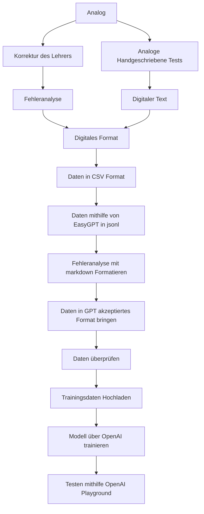

# Trainingsdaten an OpenAI senden und Modelltraining starten

Dieses Repository enthält den Code und die Anleitungen zum Senden von Trainingsdaten an OpenAI und zum Starten des Modelltrainings. Weitere Informationen zum Fine-Tuning findet man [hier](https://platform.openai.com/docs/guides/fine-tuning).

## Inhaltsverzeichnis
- [Voraussetzungen](#voraussetzungen)
- [Schritt 1: Daten vorbereiten](#schritt-1-daten-vorbereiten)
- [Schritt 3: Daten verarbeiten/überprüfen](#schritt-3-daten-überprüfen)
- [Schritt 4: Modelltraining starten](#schritt-4-modelltraining-starten)

## Voraussetzungen
Bevor Sie beginnen, stellen Sie sicher, dass Sie die folgenden Voraussetzungen erfüllen:
- Python ist installiert.
- Sie verfügen über ein API-Token von OpenAI.
- Die OpenAI Python-Bibliothek ist installiert (verwenden Sie `pip install openai`).

>[!NOTE]
> **Hinweis:** Das Erstellen eines API-Tokens finden Sie [hier](https://platform.openai.com/account/api-keys). Das Verwenden der API ist kostenpflichtig!

## Schritt 1: Daten vorbereiten
Für unser Projekt müssen wir die Trainingsdaten von einem analogen Format in ein digitales Format umwandeln. Dies kann entweder manuell erfolgen oder mithilfe fortschrittlicher OCR-Software, die handgeschriebenen Text einscannt.



Da unser Modell Tests bewerten soll, brauchen wir immer 3 verschiedene Inputs, die das Modell benoetigt:|

1. **Aufabenstellung inkl. Quellen, Tabellen usw.**

2. **Antworten des Schuelers**

3. **Fehleranalyse (Bewertung des Lehrers)**

4. **Ehr Optional Punkte pro Aufgabe**


### Fehleranalyse
Die **Fehleranalyse** ist der Teil, denn wir unserem Modell spaeter als Output vorgeben werden, also dass, was es antworten soll.
>[!IMPORTANT]
>Die Fehleranalyse ist ein Teil der Trainingsdaten, ist **menschlich verfasst**, und basiert auf den Bewertungen der Lehrer in Tests
>Sie wurden Digitalisiert und dem Modell **angepasst**, um es auf Zitierung usw. zu trainieren!

Die Idee ist hierbei, diese so uebersichtlich wie moeglich zu gestalten. Eine Fehleranalyse besteht aus folgenden Parts hier ist ein Beispiel:

```python
Fehleranalyse: 

Aufgabe 1 (6 von 6 Punkte) //Aufgabe mit voller Punktzahl
Aufgabe 2 (6 von 8 Punkte):

- "als auch die soziale Disziplinierung" bezieht sich auf " z.B. Durch Bildung usw." Ist falsch! (-1 Punkt) 

- "ein komplexer und langjähriger Prozess war" Warum? Kriege... ungenau (-1 Punkt) 

Aufgabe 3 (7 von 7 Punkte) 

Insgesamt: 
	Punkte: 18 von 21, das entspricht einer Leistung von: 85% 
	Vorgeschlagene Note: 1-
```

In der Fehleranalyse, welche immer gleich Aufgebaut ist, stellen wir nun alle Fehler im Test geordnet dar.
Als erstes haben wir unsere Ueberschrift:
```Fehleranalyse:```
Dann Listen wir Aufgabe fuer Aufgabe auf:
```python
Aufgabe 1 (6 von 6 Punkte) //Aufgabe mit voller Punktzahl
Aufgabe 2 (6 von 8 Punkte): // Aufgabe mit Fehlern
```
In unsere Aufgabe mit Fehlern Listen wir nun alle Fehler der jeweiligen Aufgabe auf. In Aufgabe 2, haben wir
z.B. folgende Fehler:
```python
Aufgabe 2 (6 von 8 Punkte):

- "als auch die soziale Disziplinierung" bezieht sich auf " z.B. Durch Bildung usw." Ist falsch! (-1 Punkt) 

- "ein komplexer und langjähriger Prozess war" Warum? Kriege... ungenau (-1 Punkt) 
```
1. Wir achten hierbei darauf, dass wir Zitieren, um das Modell darauf zu trainieren, die Fehler zu makieren.
2. Optional, geben wir auch eine Frage oder Eine Erklaerung mit, um das Modell auch darauf zu Trainieren.
3. Schlussendlich, geben wir einen Punktabzug an, um dem Modell zu zeigen, wie viel Punktabzug, welcher Fehler 'Wert' ist.

Zum Schluss, soll das Modell eine Schnelluebesicht ausgeben hier ```Insgesamt```.
Hier sollen die Punkte, Leistung in ```%``` und die Vorgeschlagene ```Note``` angegeben werden.

>[!NOTE]
>Das Modell wird groesstenteils auf Tests der Oberstufe trainiert, um eine genauere bewertung zu ermoeglichen. 
>Daher sind die Leistung, als auch die Note dem Oberstufensystem angepasst. Hierbei rechnen wir die ```Punkte``` in Leistung ```%``` um
>Die sich daraus ergebenden Oberstufen Notenpunkte, werden in Normalen Noten angegeben.

Haben wir unsere Trainingsdaten umgewandelt (Word-Dokument), koennen wir zu Schritt 2 uebergehen:

## Schritt 2: Daten vorbereiten
### Das Daten Vorbereiten, ist nach dem Digitalisieren das aufwendigste und passiert in mehreren Schritten


1. CSV-Format: Die Daten aus den Word-Dokumenten können in ein CSV-Tabellendokument exportiert werden, um eine tabellarische Darstellung zu erhalten. Hierbei werden zwei Spalten erstellt: eine für die Eingabe (Prompt) und eine für die erwartete Ausgabe (Antwort).


2. Wir wandeln die Fehleranalyse in eine Markdown formatierte Datei um, welche dauerhaft die selbe art der Foramtierung aufweist, um diese dem Modell zu erlernen. Solch eine Date kann z.b. so aussehen:
   ```jsonl
	"Fehleranalyse:\n\tDIE REFORMATION MARTIN LUTHER - EINE QUELLE ANALYSIEREN:\n\n\tA (5 von 8 Punkte):\n\t\t- Auf vollständige Sätze achten! (-1 Punkt)\n\t\t- \"Textart: Quasi (Statement)\" ist falsch. Die Textart = Brief (-1 Punkt)\n\t\t- \"Adressanten: An alle 	gläubigen und Beiger\" ist falsch! Der Brief richtet sich an \"Erzbischof Albrecht von Mainz\" (-1 Punkt)\n\n\tB (5 von 5 Punkte)\n\tC (5 von 5 Punkte)\n\n\tAufgabe 2 (5 von 6 Punkte):\n\t\t- Bezug zur Reformation ist unvollständig (-1Punkt)\n\n\tInsgesamt:\n\t\tPunkte: 20 von 24, das entspricht einer Leistung von: 83%\n\t\tVorgeschlagene Note: 2+ ENDSTOP"
   ```
   >[!NOTE]
   >ENDSTOP = Der Schluss, damit trainieren wir dem Modell unteranderem an, wie viel es Antworten soll
   Das Modell lernt mit der Zeit die Fehleranalyse mit \t\n auszugeben.
   Hierbei enstpricht ```\n``` einem Zeilenumbruch und ```\t``` einem Tab. So sieht diese Datei Spaeter auf z.b. einer Website so aus:
   

4. Die CSV Datei, senden wir nun an [EasyGPT](https://easygpt.io/), eine Website, die unteranderem die Daten als JSONL Datei wieder ausgeben kann. JSONL ist das dateinformat, welches OpenAI verlangt.
   Haben wir die Daten als JSONL, muessen wir sie aber nun noch in ein gueltiges Format fuer die Chat-Modell umwandeln.
   Das Modell, welches wir benutzen ist: ```gpt-3.5-turbo-0613```. Dieses Chat-Modell akzeptiert folgendes Format:
   ```jsonl
   {"messages": [{"role": "system", "content": "Die Rolle des Modells z.b. Geschichtslehrer"},{"role": "user", "content": "Eingabe des Benutzers z.b. Test"},{"role": "assistant", "content":"Erwartete Antwort des Modells auf die Gegebene Eingabe des Nutzers"}]}
   "..."
   "..."
   ```
   Wir erhalten aber nun folgendes Format von EasyGPT:
   ```jsonl
   {"prompt": "eINGABE", "completion": "AUSGABE MODELL"}
   ```
   Nach der Manuellen Umwandlung in das erste Format, welches wir benoetigen ```{"messages": [{"role": "system", "content":""...```, haben wir eine Trainingsdatei.
   Solch eine Date kann z.b. so aussehen [Trainingdata](./trainingsdatagpt3.5.jsonl)
   
6. Unsere Trainingsdatei, welche nun immer ein Test und eine Fehleranalyse im gewuenschten Output stehen hat, laden wir nun auf die OpenAI Server hoch.
   ```python
	import openai
	import os
	openai.api_key = "API-KEY"
	
	response = openai.File.create(
	  file=open("trainingsdata.jsonl", "rb"), //Auswahl der Trainingsdaten-Datei
	  purpose='fine-tune' // Auftrag: Fine Tuning
	)
	
	print(response) //Ausgabe der File-ID, welche wir von OpenAI bekommen

	#Teile hiervon sind von diesem Tutorial: https://www.youtube.com/watch?v=_yzmQbez7gk&t
   ``` 

## Schritt 3: Daten überprüfen
Vor dem Senden der Daten an OpenAI ist es wichtig sicherzustellen, dass sie den Qualitätsanforderungen entsprechen. Dazu koennen wir Optional nochmals pruefen, ob unsere Trainingsdaten korrekt hochgeladen wurden
```python
import os
import openai
openai.api_key = "API-KEY"
content = openai.File.download("file-ID") //Download des trainingfiles mit der vorher erhaltenen ID
print(content) //Ausgabe der Datei
```
Und zusaetzlich Checken wir, wie viele tokens, also Woerter unsere Daten enthalten 1 Token sind hierbei ca. 3-4 Zeichen
```python
import openai
openai.api_key = 'API-KEY'

# Tokens Zaehlen
token_count = openai.Completion.create(
    engine="text-davinci-003",  # Modell
    prompt= "Test, den wir Pruefen wollen, oder Var. fuer unseren Trainingsfile",
    max_tokens=0
)['usage']['total_tokens']

print(f"Token count: {token_count}") //Ausgabe der Tokens
```
Hiermit Pruefe ich teils lange Tests, um zu schauen, ob diese nicht ueber das Eingbaelimit von 4096 tokens gehen.
Auch Optional koennen wir den Status unserer Datei abrufen mit:
```python
import openai

# API Key (privat)
openai.api_key = "API-KEY"

# File ID, aendert sich, je nach Modell
file_id = "file-ID"

file_info = openai.File.retrieve(id=file_id) //File ID suchen
print("File Status:", file_info.status)
print("Status Details:", file_info.status_details) //Status ausgeben
```


## Schritt 4: Modelltraining starten
Sind unsere Trainingsdaten hochgeladen, koennen wir nun das Training starten lassen hierzu:
```python
import os
import openai
openai.api_key = "API-KEY"
file_id = "file-ID" //File ID auswahlen
response = openai.FineTuningJob.create(training_file=file_id, model="gpt-3.5-turbo-0613") //Modell waehlen
print(response)
```
Dieser Code passt keine Variablen des Modells an, sondern laesst es automatisch selber entscheiden.
Hier legt es z.b die ```Epochs```, also die Trainingszyklen und weitere Parameter fest.
[Weitere Informationen zu Parametern (nutzung)](https://github.com/cheatoskar/Test-GPT#openai-playground-gpt-3-parameter)


Danach erhaelt man eine Email, dass sein Modell fertig ist, dieser Prozess dauert meist 5-20min.

Unser Modell koennen wir nun testen auf [OpenAI Playground](https://platform.openai.com/playground).
Oder wir machen anfragen direkt ueber python.

Im OpenAI Playground koennen wir einfach Sachen anpassen, prompts,Rollen eingeben und experimentieren. Aussderem, koennen wir Chats Speichern, und diese folglich spaeter anschauen zur Analyse:
Hier sind einige Chats:
[v1.1/1.2 Chat 1](https://platform.openai.com/playground/p/tYEIgF7qAND2GTmJZL9Lpeib?model=ft:gpt-3.5-turbo-0613:personal::8F1RLvEo)

[v1.2 Chat 2](https://platform.openai.com/playground/p/AUmLC8W1ZxHYm2oUCFjFVhIp?model=ft:gpt-3.5-turbo-0613:personal::8F1RLvEo)

[v1.2 Chat 3](https://platform.openai.com/playground/p/0oV0PGXwWyzO2wTIA408mzSH?model=ft:gpt-3.5-turbo-0613:personal::8F1RLvEo)

Aeltere Modelle:
[v 1.0 Chat 4](https://platform.openai.com/playground/p/E4J2AOMLS6MdwroNqsV224Ok?model=ft:gpt-3.5-turbo-0613:personal::849ySJer)
